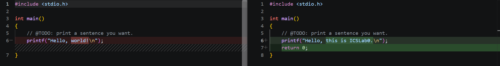
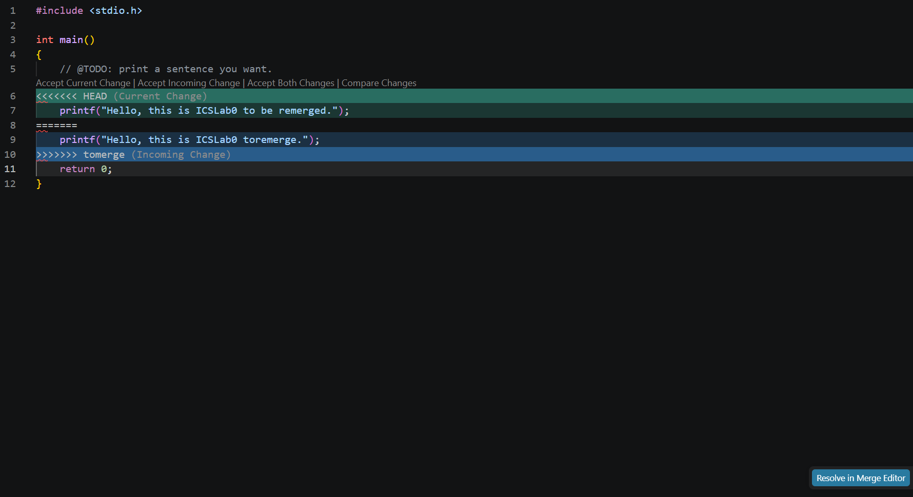
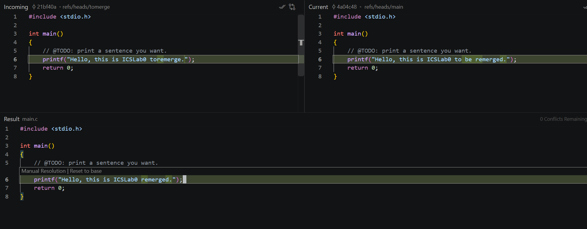

# Lab0: Report

## TODO1：回答问题

1. **你之前有过多人协同开发的经历吗？如果有，你们是使用什么方式分工协作的？**

   上学期完成大作业时尝试采用 Git，但是组员操作不熟练，最后采取的办法是修改代码全部在一个人的电脑上进行，然后用微信传输更新的代码。

2. **思考一下，Git 为什么要设计"暂存-提交"两个步骤？**

   Git 把一次提交拆成"暂存（`git add`）"和"提交（`git commit`）"两个步骤，主要有以下几个原因：

   - **灵活地挑选改动**：一次修改可能涉及多个文件，其中一部分已经完成、另一部分还在进行中。通过暂存区可以只把完成的部分加入本次提交，而不必把所有改动一次性提交。
   - **便于回顾和整理提交**：在提交之前可以先 `git diff --staged` 查看即将提交的内容，确认无误后再提交，减少误提交。
   - **让提交更聚焦**：可以把一次逻辑上的改动拆成多个语义清晰的小提交，而不是一个大杂烩式的提交，方便日后回溯和 `git blame` / `git bisect` 定位问题。
   - **暂存区充当"中间缓冲区"**：工作区的内容先进入暂存区，再进入版本库，形成"工作区 → 暂存区 → 版本库"的三层结构，让每一步都可控、可逆。

3. **`git branch` 和 `git branch -a` 的区别是什么？**

   - `git branch`：默认只列出**本地分支**，不带任何参数时查看本地有哪些分支。
   - `git branch -a`：列出**所有分支**，包括本地分支和远程跟踪分支（remote-tracking branches，通常以 `remotes/origin/xxx` 的形式显示）。

   简单来说，`git branch -a` 比 `git branch` 多显示了远程仓库中的分支情况，便于了解远程仓库的完整分支视图。

## TODO2：完成 `main.c` 中的 TODO 并提交

在 `main.c` 中填写 `@TODO` 部分，输出一句自定义的话：

```c
#include <stdio.h>

int main()
{
    // @TODO: print a sentence you want.
    printf("Hello, this is ICSLab0.");
    return 0;
}
```

随后执行 `git add main.c` 与 `git commit` 完成一次提交。



## TODO3：阅读资料并谈谈对 Git 的理解

**（1）Commit Message 规范**

该文介绍了如何写出规范的提交信息。一个良好的 commit message 通常由标题（header）、正文（body）和脚注（footer）三部分组成，标题要简短、用祈使语气概括本次改动，正文说明"为什么"要这样改，脚注可以关联 issue 或说明破坏性变更。规范的提交信息配合工具可以自动生成 Change Log，让项目的变更历史清晰可读。

**（2）Git Flow 分支控制**

Git Flow 是一种成熟的分支管理模型，围绕 `master`（稳定发布分支）与 `develop`（开发主干分支）展开，并用 `feature`、`release`、`hotfix` 等临时分支来承载不同阶段的开发：新功能在 `feature` 分支上开发后合并回 `develop`，发布时从 `develop` 拉出 `release` 分支做测试与收尾，线上紧急问题用 `hotfix` 分支快速修复。这种模型让团队协作更有条理，也便于并行开发和发布管理。

**谈谈"为什么要学习 Git"**

Git 是目前最主流的分布式版本控制系统。学习 Git 的意义在于：

- **协同开发的基础**：多人同时修改同一份代码时，Git 能记录每个人的改动、合并不同人的工作，避免"谁覆盖了谁的代码"这类问题。
- **完整的修改历史**：每一次提交都保留了时间、作者和修改内容，出现问题可以随时回退到任意历史版本，方便定位和修复 bug。
- **分支管理能力**：借助分支可以并行开展不同功能、隔离实验性改动，成熟后再合并，互不干扰。
- **安全与可追溯**：分布式架构下每个人的本地仓库都是完整备份，代码不易丢失，改动责任清晰。

## TODO4：分支管理、合并与冲突处理

1. 新建 `tomerge`分支与`main`分支对`main.c` 进行修改与提交，修改同一句话使两处改动在合并时产生冲突。
2. 切回 `main` 分支执行 `git merge tomerge`，触发合并冲突：

   

3. 手动编辑 `main.c`，解决冲突后 `git add` 并完成合并提交：

   


